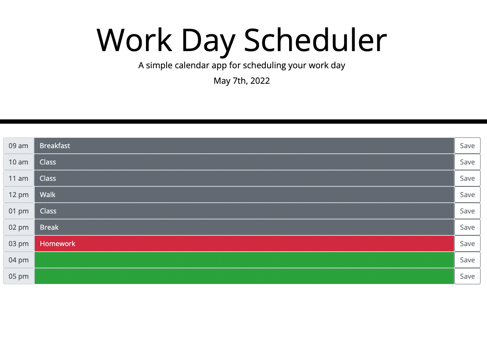

# Day Planner

## Description

This is a day planner, created using Javascript, Bootstrap, jQuery, and Moment.JS [link to the deployed page](https://ajolsavsky.github.io/day-planner/).

Some things that I learned while creating this project:

- How to create if statements for time; using Moment.JS functionality to determine the different between the current hour vs. previous hours allowed for comparisons in number values that would allow for dynamic styling to render
- I expanded my knowledge of the for loop and was able to dynamically render the scheduler to the page
- Utilize local storage to house entries
- Utilize event propogation and event.targe to specify event listeners
- Traverse the DOM to identify specific values from the event.target

## User Story

```md
AS AN employee with a busy schedule
I WANT to add important events to a daily planner
SO THAT I can manage my time effectively
```


## Acceptance Criteria

```md
GIVEN I am using a daily planner to create a schedule
WHEN I open the planner
THEN the current day is displayed at the top of the calendar
WHEN I scroll down
THEN I am presented with timeblocks for standard business hours
WHEN I view the timeblocks for that day
THEN each timeblock is color coded to indicate whether it is in the past, present, or future
WHEN I click into a timeblock
THEN I can enter an event
WHEN I click the save button for that timeblock
THEN the text for that event is saved in local storage
WHEN I refresh the page
THEN the saved events persist
```

## Usage

Here is an example of the final page.



## Credits

This project and related assets are associated with the Triolgy Coding Bootcamp.

## License

© 2022 Trilogy Education Services, LLC, a 2U, Inc. brand. Confidential and Proprietary. All Rights Reserved.
